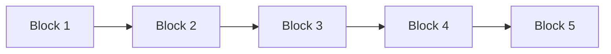

## What is Blockchain?

A blockchain is a `distributed ledger` with growing lists of records (blocks) that are securely linked together via `cryptographic hashes`. Each block contains `a cryptographic hash` of the previous block, a timestamp, and transaction data (generally represented as a Merkle tree, where data nodes are represented by leaves). Since each block contains information about the previous block, they effectively form a chain (compare linked list data structure), with each additional block linking to the ones before it. Consequently, blockchain transactions are irreversible in that, once they are recorded, the data in any given block cannot be altered retroactively without altering all subsequent blocks.
###### source: https://en.wikipedia.org/wiki/Blockchain

## What Is Bitcoin?

Bitcoin (BTC) is a `cryptocurrency`, a virtual currency designed to act as money and a form of payment outside the control of any one person, group, or entity, thus removing the need for third-party involvement in financial transactions. It is rewarded to blockchain miners for verifying transactions and can be purchased on several exchanges.
###### source: https://www.investopedia.com/terms/b/bitcoin.asp

Bitcoin (abbreviation: BTC[a] or XBT;[b] sign: ₿) is the first `decentralized cryptocurrency`. Nodes in the peer-to-peer bitcoin network verify transactions through cryptography and record them in a public distributed ledger, called a blockchain, `without central oversight`.
###### source: https://en.wikipedia.org/wiki/Bitcoin
